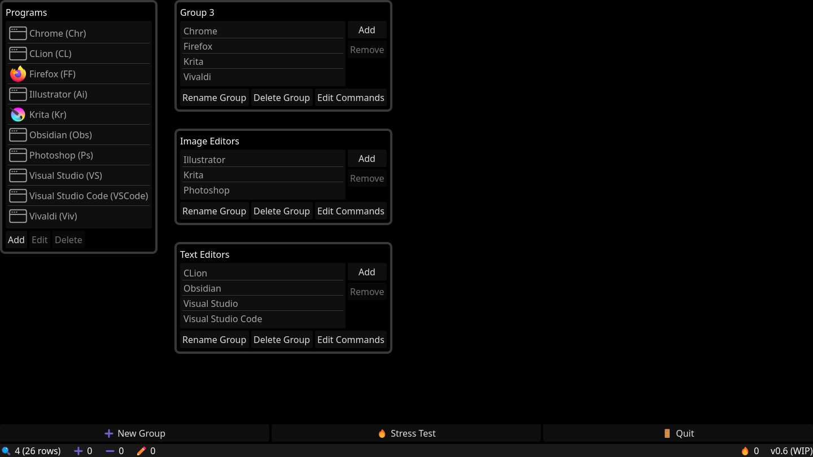
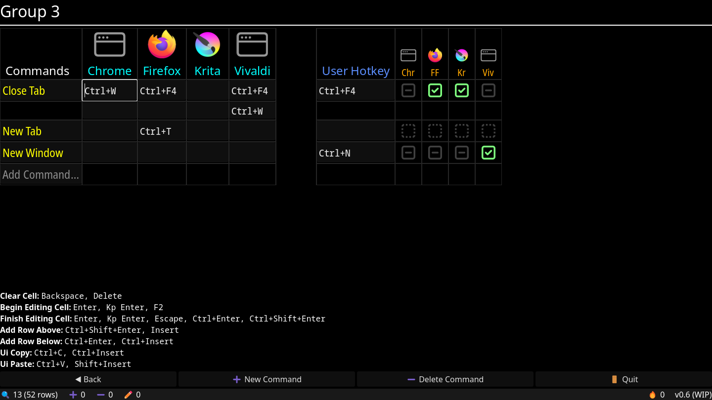

# Hotkeys Manager (WIP)

A tool to organize and build a common set of hotkeys & shortcuts across multiple programs.

 

## Credits

- Checkbox icons by [Adam Whitcroft](https://github.com/d8vjork/batch-icons?ref=svgrepo.com) in MIT License via [SVG Repo](https://www.svgrepo.com).
- Default program icon by [Framework7io](https://github.com/framework7io/framework7-icons?ref=svgrepo.com) in MIT License via [SVG Repo](https://www.svgrepo.com).
- [Firefox icon](https://github.com/mozilla-firefox/firefox/blob/main/browser/branding/official/default64.png), by the [Mozilla Corporation](https://www.mozilla.org), licensed under the [MPL 2.0 License](https://github.com/mozilla-firefox/firefox/blob/main/browser/branding/official/LICENSE).
- [Krita icon](https://invent.kde.org/graphics/krita/-/blob/master/pics/krita.png), by the [Krita](https://krita.org) project, licensed under the [GPL3 License](https://invent.kde.org/graphics/krita/-/blob/master/COPYING).
- [Noto Sans](https://fonts.google.com/noto/specimen/Noto+Sans) and [Noto Sans Mono](https://fonts.google.com/noto/specimen/Noto+Sans+Mono) fonts, by Google, licensed under the [SIL Open Font License Version 1.1](https://openfontlicense.org/open-font-license-official-text/).
